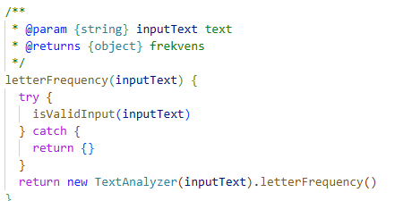
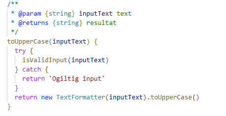
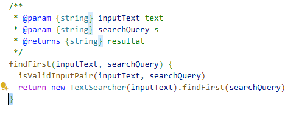
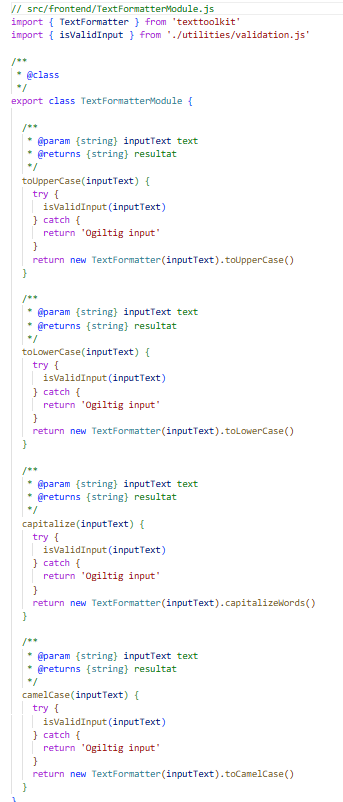
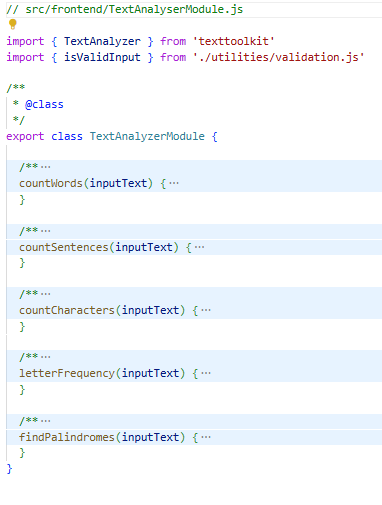

# Reflektion Clean Code

Denna reflektion beskriver hur varje kapitel i "Clean Code" har påverkat min kodbas. Till varje kapitel ges en kort reflektion och ett konkret kodexempel.

Det var inte så enkelt att ta screen shots till varje kapitel men det finns till en del.

Reflektioner på Kap 11 var inte så enkelt att få till (jag hade nog inga...) så där bad jag min AI om hjälp och det var kanske inte meningen men jag lärde mig iallafall lite på det men det är ju inte min reflektion.

---

## Kapitel 2: Meaningful Names

Jag har lagt stor vikt vid att använda beskrivande och konsekventa namn på klasser, metoder och variabler. Det gör koden självdokumenterande och lätt att förstå. Jag har försökt att tillämpa "Meningsfulla namn ska avslöja funktionalitet" och "Namnet ska vara uttalbart och sökbart". Jag hade en metod som jag döpt till letter som räknar hur många ggr varje bokstav finns i texen, dvs hur många a och hur många b osv men döpte om den till letterFrequency för att göra det solklart vad den gör. Exempel innan:

```js
// TextAnalyserModule.js
letter(inputText) {
  // ...
}
```

Screenshot av hur det blev:



---

## Kapitel 3: Functions

Alla funktioner är små, har brutit ut så mycket det går, gör bara en sak och har tydliga namn. Jag undviker sid-effekter och duplicerad logik. Har tillämpat "En abstraktionsnivå per funktion", "Få argument" och "Tydlig felhantering" med exceptions. Innan innhöll varje metod en validering kod per metod men jag bröt ut den först som en privat function per modul fil men la den till slut i en egen fil (utilities/validation.js). Koden såg ut så här när jag startade:

```js
// TextFormatterModule.js
toUpperCase(inputText) {
  if (typeof inputText !== 'string' || inputText.trim().length === 0) {
    return ''
  }
  return new TextFormatter(inputText).toUpperCase()
}
```

Screenshot av ändringen blev det så här:



---

## Kapitel 4: Comments

Jag har tagit bort överflödiga kommentarer och istället gjort koden självdokumenterande. Endast nödvändiga JSDoc-kommentarer för publika metoder finns kvar.
Jag har med avsikt försökt ha så små och korta jsdoc kommentarer som möjligt då många egentligen är onödiga enligt mitt tycke men ESLint och jag är inte alltid överens där. Jag hade från början till exempel:

```js
/**
 * Finds the first occurrence of searchQuery in inputText.
 */
findFirst(inputText, searchQuery) { ... }
```

Men efter att ha kört lint blev det följande screenshot:



Personligen tyckte jag nog det var bättre innan...

Try/catch saknas i denna fil eftersom felen här hanteras i gränssnittet

---

## Kapitel 5: Formatting

Koden är konsekvent indragen, har luft mellan logiska block och är lätt att överblicka. Det gör det enkelt att hitta och förstå kodens struktur. Mycket av formatteringen sköter ju VSC med automatik så detta är egentligen inget problem år 2025 men kanske var ett större problem när boken skrevs i början av 2000-talet så i denna regel är det nog punkt 3 i listan som man bör fundera över. I min lilla app var det knappast någon stor grej.

- Indrag är konsekvent (2 blanksteg).
- Tomrader används för att separera metoder och logiska block.
- Relaterade metoder är grupperade.
- Inga onödiga tomrader eller trånga kodblock.
- Kod är lättläst och följer modern JS-stil.

Exempel:

```js
// TextTransformerModule.js
reverseWords(inputText) {
  if (!isValidInput(inputText)) return ''
  return new TextTransformer(inputText).reverseWordOrder()
}
```

Screen shot på en 60 raders modul (TextFormatterModul.js)



---

## Kapitel 6: Objects and Data Structures

Varje modul är en klass med endast publika metoder för att utföra textoperationer.
All data är inkapslad – det finns inga publika fält, bara metoder.
Valideringslogik var från början privat (#isValidInput), vilket följer principen om inkapsling. Men refacoriserades sedan till en util metod (validation.js)

- Inga onödiga getters/setters eller dataläckage.
- Gränssnittet är tydligt: varje klass erbjuder bara de operationer som är relevanta för dess syfte.
- Ingen blandning av data och logik – klasserna är renodlade serviceklasser.

Exempel:

```js
export class TextAnalyserModule {
  countWords(inputText) { ... }
}
```

Screenshoot>



---

## Kapitel 7: Error Handling

Innan jag gick igenom kapitel 7 använde jag inte try/catch, men det införde jag i vissa moduler. Felhanteringen är nu blandad:

- I t.ex. TextFormatterModule används try/catch och returneras en tydlig felsträng ("Ogiltig input") vid ogiltig indata.
- I t.ex. TextSearcherModule kastas undantag direkt vid felaktig input, och UI:t (app.js) fångar och visar felmeddelande.

Detta gör att fel upptäcks tidigt och hanteras explicit, men på olika sätt beroende på modul. Ingen tyst felhantering förekommer längre, och all felhantering är synlig och testbar. Exempel:

```js
// TextFormatterModule.js
toUpperCase(inputText) {
  try {
    isValidInput(inputText)
  } catch {
    return 'Ogiltig input'
  }
  return new TextFormatter(inputText).toUpperCase()
}

// TextSearcherModule.js
isValidInputPair(inputText, searchQuery) // kastar undantag vid fel
return new TextSearcher(inputText).findFirst(searchQuery)

// app.js (UI)
try {
  resultDisplay.textContent = 'Första: ' + searcher.findFirst(userInputTextArea.value, searchQueryInput.value)
} catch (err) {
  resultDisplay.textContent = 'Fel: ' + err.message
}
```

---

## Kapitel 8: Boundaries

Alla externa beroenden (texttoolkit) är helt inkapslade i mina egna moduler. Min applikation är skriven mot mina egna gränssnitt, vilket gör det lätt att byta ut eller mocka externa bibliotek. Detta är exakt enligt Clean Code kapitel 8. Detta gör att jag inte hade några problem med denna regel

Exempel:

```js
import { TextFormatter } from 'texttoolkit'
// ...
return new TextFormatter(inputText).toUpperCase()
```

---

## Kapitel 9: Unit Tests

Testerna är en central del av min kodbas och har utvecklats parallellt med implementationen. Jag har lagt stor vikt vid att:

- Skriva tester med beskrivande namn som tydligt anger vad som testas och vilket resultat som förväntas.
- Täckning av både normalfall och edge cases, t.ex. tomma strängar, null, ogiltig input och specialtecken.
- Testa felhantering: att metoder returnerar rätt felvärde eller kastar undantag vid ogiltig input.
- Säkerställa att testerna är oberoende av varandra och kan köras i valfri ordning.
- Använda Vitest som testverktyg för snabb feedback och tydliga felrapporter.

Jag har även refaktorerat testerna när implementationen ändrats, t.ex. när felhantering gick från undantag till felsträng eller tvärtom. Detta har gjort att testerna alltid speglar aktuell kodlogik och snabbt visar om något bryter mot förväntat beteende.

Exempel på test för normalfall:

```js
it('toUpperCase returnerar versaler', () => {
  expect(formatter.toUpperCase('hej')).toBe('HEJ')
})
```

Exempel på test för edge case/felhantering:

```js
it('toUpperCase hanterar felaktig input', () => {
  expect(formatter.toUpperCase('   ')).toBe('Ogiltig input')
  expect(formatter.toUpperCase(null)).toBe('Ogiltig input')
})
```

Jag har även testat att undantag kastas och hanteras korrekt i moduler där det är relevant, t.ex. TextSearcherModule. Alla tester går igenom och är lätta att felsöka tack vare tydliga felmeddelanden och isolerade testfall. Dokumentation av automatisk testkörning finns i [Test_Report](TEST_REPORT.md)

---

## Kapitel 10: Classes

Jag har även dokumenterat klasserna med JSDoc för att tydliggöra syfte och användning. Denna struktur gör det enkelt att lägga till nya funktioner eller ändra befintliga utan att påverka andra delar av systemet.

Kapitel 10 i Clean Code handlar om att klasser ska vara små, ha ett tydligt ansvar och vara lätta att förstå och underhålla. En klass ska representera en enda abstraktion och inte blanda flera syften. Jag har försökt följa detta genom att skapa modulklasser som bara hanterar en typ av textoperation, till exempel formattering eller analys. All logik som inte hör till klassens kärnsyfte har brutits ut till util-filer, vilket gör klasserna renare och mer fokuserade. Jag undviker att blanda data och logik, och har inga onödiga publika fält eller metoder. Klasserna är enkla att utöka med nya metoder utan att påverka befintlig funktionalitet. Jag har även dokumenterat publika metoder med JSDoc för att tydliggöra syfte och användning.

Exempel på en typisk klass:

```js
export class TextFormatterModule {
  toUpperCase(inputText) {
    // validering och formattering
  }
  toLowerCase(inputText) {
    // validering och formattering
  }
  // ... fler formatteringsmetoder
}
```

---

## Kapitel 11: Systems

Systemet är designat för att vara löst kopplat och modulärt. Varje del har ett tydligt ansvar och kommunicerar via väldefinierade gränssnitt (känns nästan överambitiöst att säga så...). Det innebär att:

- Moduler kan bytas ut, testas eller vidareutvecklas utan att påverka resten av systemet.
- UI:t är separerat från logik – all textbehandling sker i moduler, och gränssnittet anropar bara publika metoder.
- Felhantering är centraliserad i UI:t för vissa moduler, vilket gör det enkelt att ge användaren tydlig feedback.
- Systemet är lätt att bygga ut med nya funktioner, t.ex. genom att lägga till nya moduler eller metoder.
- Testbarheten är hög eftersom varje modul kan testas isolerat och systemet är fritt från hårda beroenden.

En viktig princip jag har använt är dependency injection för att underlätta testning och utbyte av implementationer. Istället för att hårdkoda beroenden, skickas t.ex. valideringsfunktioner eller externa tjänster in som parametrar till moduler eller metoder. Detta gör det enkelt att mocka eller byta ut implementationer vid testning, till exempel genom att ersätta en riktig valideringsfunktion med en teststub, eller byta ut en textbehandlingsmodul mot en alternativ version. I tester kan jag därmed kontrollera exakt vilka beroenden som används, vilket ger isolerade och pålitliga tester. Samma princip gör det enkelt att vidareutveckla systemet – om en ny implementation behövs kan den injiceras utan att resten av koden behöver ändras. Detta följer Clean Code-principen om att undvika hårda beroenden och främjar både testbarhet och flexibilitet.

Systemet är robust mot förändringar och kan enkelt anpassas till nya krav.
Det är dock viktigt att påpeka att mitt system använder min npm-modul `texttoolkit`, vilket innebär att det finns beroenden mot tredjepartsbibliotek. Enligt Clean Code kapitel 11 bör sådana beroenden kapslas in och hanteras via egna gränssnitt, så att resten av systemet inte direkt påverkas av förändringar i modulen. I min kod försöker jag därför använda npm-moduler på ett sätt där de är isolerade till specifika moduler, och där min applikation kommunicerar med dem via egna metoder och gränssnitt. På så sätt minimeras risken att hela systemet påverkas om ett externt bibliotek skulle ändras eller bytas ut.

Nedan följer några kodexempel som visar hur dessa principer tillämpas:

**Exempel på inkapsling av npm-modul (texttoolkit):**

```js
// TextFormatterModule.js
import { TextFormatter } from 'texttoolkit'

export class TextFormatterModule {
  constructor(validationFn) {
    this.validate = validationFn
  }
  toUpperCase(inputText) {
    if (!this.validate(inputText)) return 'Ogiltig input'
    // Inkapsling av npm-modul: all logik går via denna metod
    return new TextFormatter(inputText).toUpperCase()
  }
}
```

*Förklaring:* I exemplet ovan används npm-modulen `texttoolkit` endast inuti TextFormatterModule. Applikationen anropar aldrig texttoolkit direkt, utan kommunicerar alltid via egna metoder och gränssnitt. Om implementationen eller biblioteket skulle ändras, behöver bara TextFormatterModule uppdateras – resten av systemet påverkas inte. Detta följer Clean Code kapitel 11 om att kapsla in beroenden och exponera egna gränssnitt.

---
